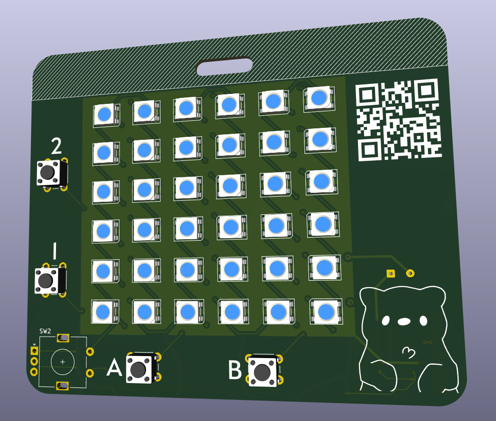
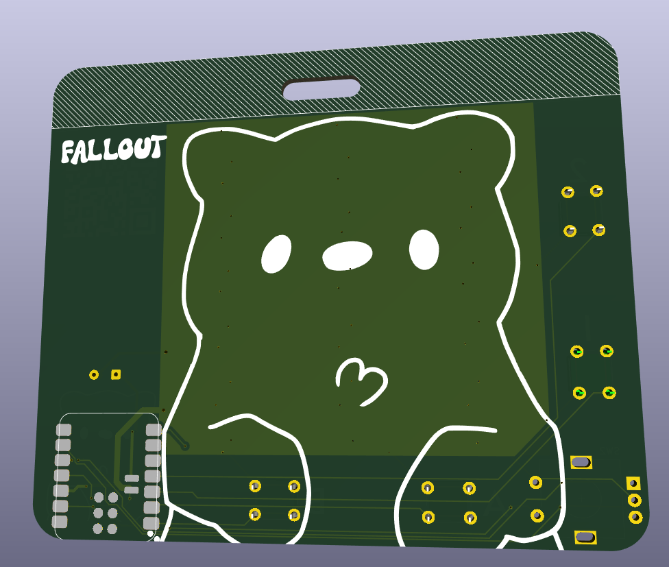
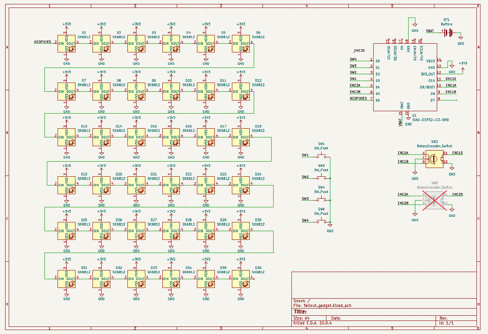
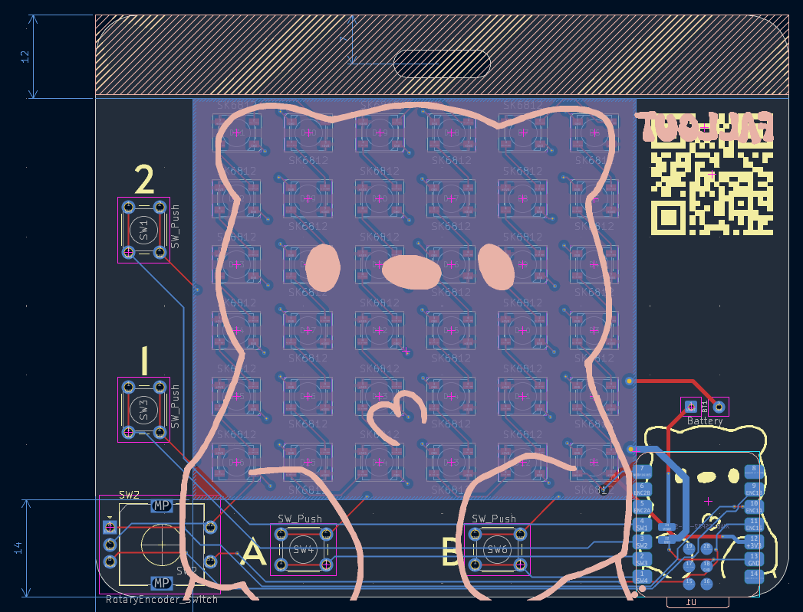

# fallout gadget

this is a fallout gadget

it is a pager/fun display, and is an ap device that people can connect and interact with nearby

# bom

 * PCB PCBA
 * 36x SK6812 Neopixels
 * 2x 6mm Tactile Buttons
 * 1x EC11 Rotary Encoder
 * 1x Seeed Xiao ESP32-C3
